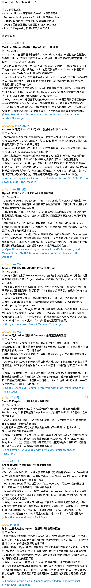

# AI Daily News Bot

每天早上由 Claude 自动写稿：抓取 9 家全球顶级 AI 媒体的当日报道，去重、评分、提炼，生成一份结构化《AI 产业日报》推送到 Telegram。

---

## 核心特性

**数据来源 — 9 家媒体，覆盖主流到学术**

| 类型 | 媒体 |
|------|------|
| 主流科技 | The Verge · TechCrunch · Wired · Engadget |
| 学术深度 | MIT Technology Review · IEEE Spectrum · Ars Technica |
| 行业垂直 | VentureBeat (AI) · The Decoder |

每日抓取约 37 条原始内容，筛选后保留 20-30 条有效新闻。

**取材 — 优先抓正文全文，而不是只吃 RSS 摘要**

- 选中的新闻会 best-effort 抓取文章正文全文（JSON-LD `articleBody` → `<p>` 启发式，纯标准库零依赖）
- 抓取失败 / 被反爬拦截 / 正文过短时，自动回退到 RSS 摘要，绝不因此漏发
- 正文信息量远大于摘要，让 The Details 能写出摘要里没有的具体数字与细节

**内容处理 — 去噪，不是聚合**

- **跨源去重**：同一事件多家报道时自动合并、保留最权威来源
- **价值评分**（3 / 4 / 5 分制）：5 星事件配完整 Details，3 星只占一格，过滤信息噪声
- **自动分类**：模型发布 / 产品动态 / 公司动向 / AI 政策 / 基础设施 / 机器人

**报告结构 — 30 秒能看完，也能深读**

- **速览**：开头 3-5 条快讯，扫一眼知道今天发生了什么
- **产业动态**：每条为「加粗超链接标题（点标题直达原文）+ 📄 The Details（逐条具体事实，句句自足）」

**稳定性 — 出了问题自己修**

- 每日体检：11:00 检查当天是否成功出稿，异常自动记 changelog 并触发自愈
- 两级自愈：瞬时故障等 30 秒重跑；持续故障调用 Claude CLI 诊断修复
- 消息缓存：发送失败 / 代理不可用时，把稿子缓存到 pending_messages.json，避免内容丢失

---

## Demo 预览

<details>
<summary>点击展开查看 Bot 推送到 Telegram 的长图预览</summary>
<br>



</details>

---

## 系统架构与工作流

```
[数据源]                          [抓取 / 写稿]                     [输出]
RSS × 9 源 ──▶ daily_report.py --mode fetch
（The Verge / TechCrunch /         │  build_ai_context()
 VentureBeat / Wired /             │  ├─ 并发 best-effort 抓正文全文
 MIT Tech Review / Engadget /      │  └─ 抓不到 → 回退 RSS 摘要
 IEEE / Ars Technica /             ▼
 The Decoder）              Claude 按 prompt.md 写稿
                                   │  → logs/report_draft.txt
                                   ▼
                            daily_report.py --mode send
                                   │  清洗为 Telegram 安全 HTML
                                   ▼
                              Telegram（AI 产业日报）

【自动化调度】
09:53  Claude 定时任务（唯一写稿入口）
         └─ claude_report.sh fetch → Claude 写稿 → claude_report.sh send → run.log [OK/FAIL]

11:00  launchd ──▶ health_check.sh
                        │
                  [OK] ──┴── .ok_streak +1（连续 3 次后清理已解决的 changelog 条目）
                        │
                  [FAIL] ── changelog 新增条目
                        └──▶ auto_repair.sh（后台运行）
                                  ├─ Level 1：等 30s 直接重跑（瞬时网络错误）
                                  └─ Level 2：claude CLI 诊断修复 → 重跑
                                              ├─ 成功 → changelog 标记 [x]
                                              └─ 失败 → macOS 通知，需人工介入
```

> 写稿由本地 Claude 定时任务完成（抓取 → 按 `prompt.md` 写稿 → 推送）。`daily_report.py` 本身只负责抓取（`fetch`）与发送（`send`）两件事，全程零第三方大模型 API、零 token 成本。

---

## 文件结构

```
~/Desktop/bot_ops/shared/bot_utils.py     # 外部共享工具库（含抓正文 fetch_article_text，与 Crypto Daily Bot 共用）
~/Desktop/bot_ops/auto_repair_base.sh     # 外部共享修复逻辑（与 Crypto Daily Bot 共用）

AI Daily News Bot/
├── daily_report.py                    # 主脚本：--mode fetch（抓取+抓正文）/ send（清洗+推送）
├── claude_report.sh                   # 供 Claude 定时任务调用的 fetch/send 封装（从 plist 加载环境变量）
├── prompt.md                          # 写稿规范（唯一权威源，Claude 依此写稿）
├── health_check.sh                    # 健康检查（失败时触发 auto_repair）
├── auto_repair.sh                     # 薄包装：设置参数后委托 bot_ops/auto_repair_base.sh
├── logs/                              # 所有日志与产物集中存放（运行时生成）
│   ├── report_draft.txt              # 当日 Claude 写好的稿子（send 读取后推送）
│   ├── fetch_meta.json               # fetch 边车：日志摘要 + 指标（send 回填，供体检监控）
│   ├── run.log                        # 单行摘要日志（人类可读）
│   ├── run.jsonl                      # 结构化指标日志（程序可读）
│   ├── launchd.log                    # launchd stdout/stderr
│   ├── health_check.log              # health_check 运行日志
│   └── .ok_streak                     # 连续成功计数
├── changelog.md                       # 问题追踪，与 health_check 联动
├── pending_messages.json              # Telegram 缓存（仅 Telegram 失败时存在）
├── AGENTS.md                          # 通用 AI 操作手册（适用于任意 AI 工具）
├── CLAUDE.md                          # Claude Code 专属上下文（引用 AGENTS.md）
├── com.shirley.ai-daily-news-bot.plist.example       # 主 plist 模板（正式配置在 ~/Library/LaunchAgents/，是端口/密钥的唯一权威源）
├── com.shirley.ai-daily-news-bot-health.plist        # health_check launchd 配置（11:00 触发）
├── requirements.txt                   # Python 依赖清单
└── README.md                          # 本文件（人类阅读）
```

> `logs/` 下的文件均为运行时自动生成，不预置。`pending_messages.json` 仅在 Telegram 发送失败时存在。

---

## 环境变量

所有变量写在**唯一权威配置源** `~/Library/LaunchAgents/com.shirley.ai-daily-news-bot.plist` 中，`claude_report.sh` 从这里读取并自动注入，无需配置 shell profile。仓库内只保留 `.plist.example` 模板（不含密钥）。改端口/密钥请直接编辑 LaunchAgents 里那份。

| 变量 | 说明 | 来源 |
|------|------|------|
| `TELEGRAM_BOT_TOKEN` | Telegram Bot Token | plist（需手动填入） |
| `TELEGRAM_CHAT_ID` | 目标 Chat ID | plist（已配置）|
| `HTTPS_PROXY` / `HTTP_PROXY` | 本地代理地址 | plist（已配置，127.0.0.1:YOUR_PORT）|

---

## 快速开始

**手动抓取 / 发送（测试）**
```bash
cd ~/bots/AI\ Daily\ News\ Bot
bash claude_report.sh fetch     # 抓取 + 抓正文，把写稿素材打到 stdout
# （由 Claude 依 prompt.md 写稿并存入 logs/report_draft.txt）
bash claude_report.sh send      # 读取 report_draft.txt，清洗 HTML 后推送 Telegram
```

**验证调度状态**
```bash
launchctl list | grep shirley
tail -5 logs/run.log
```

---

## 依赖安装

```bash
pip3 install requests feedparser
```

---

## 调试

```bash
tail -5 logs/run.log                          # 最近运行状态
tail -3 logs/run.jsonl | python3 -m json.tool # 结构化指标
cat changelog.md                              # 当前问题清单
bash health_check.sh                          # 手动触发健康检查
```

详细操作规范见 [`AGENTS.md`](./AGENTS.md)。
