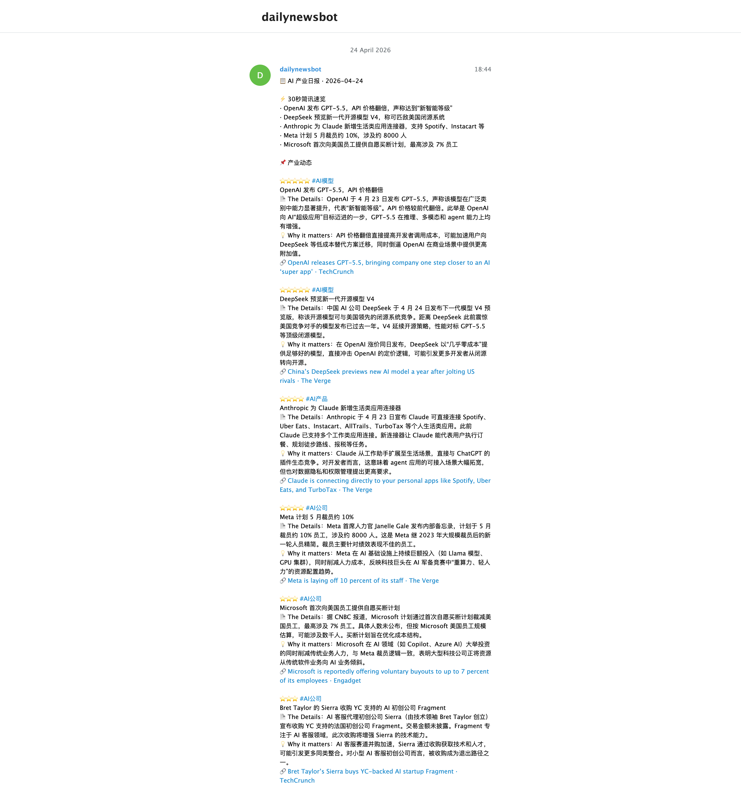

# AI Daily News Bot

每天早上 8 点自动运行。聚合 10 家全球顶级 AI 媒体的当日报道，由 DeepSeek 完成去重、评分与深度分析，生成一份结构化日报发到 Telegram。不用打开浏览器，不用切换信息源，值得看的 AI 动态已经替你整理好了。

---

## 核心特性

**数据来源 — 10 家媒体，覆盖主流到学术**

| 类型 | 媒体 |
|------|------|
| 主流科技 | The Verge · TechCrunch · Wired · Engadget |
| 学术深度 | MIT Technology Review · IEEE Spectrum · Ars Technica |
| 行业垂直 | VentureBeat (AI) · The Decoder |

每日抓取约 37 条原始内容，筛选后保留 20-30 条有效新闻。

**内容处理 — 去噪，不是聚合**

- **跨源去重**：同一事件多家媒体报道时，自动合并、保留最权威来源
- **价值评分**（3 / 4 / 5 分制）：5 星事件配完整深度解读，3 星只占一格，过滤掉信息噪声
- **自动分类**：模型发布 / 产品动态 / 公司动向 / AI 政策 / 基础设施 / 机器人

**报告结构 — 30 秒能看完，也能深读**

- **速览**：开头 5 条快讯，扫一眼知道今天发生了什么
- **深度**：The Details + Why it matters，说清楚事件背景、影响谁、为什么重要

**稳定性 — 出了问题自己修**

- 代理预检：启动时先验证网络可用，不通立即报错退出，不浪费等待时间
- 两级自愈：瞬时故障等 30 秒重跑；持续故障调用 Claude CLI 自动诊断修复
- 消息缓存：发送失败不丢消息，下次运行优先补发

---

## Demo 预览
 
 <details>
 <summary>点击展开查看 Bot 推送到 Telegram 的长图预览</summary>
 <br>
 
 
 
 </details>
 
 ---

## 系统架构与工作流

```
[数据源]                      [处理]           [输出]
RSS × 10 源 ──▶  build_ai_context()
（The Verge / TechCrunch /      │
 VentureBeat / Wired /          ▼
 MIT Tech Review /        generate_report()
 Engadget / IEEE /         (DeepSeek × 1)  ──▶  Telegram（AI 产业日报，段落分块发送）
 Ars Technica /
 The Decoder）

【自动化调度】
08:00  launchd ──▶ daily_report.py ──▶ run.log [OK/FAIL]
08:30  launchd ──▶ health_check.sh
                        │
                  [OK] ──┴── .ok_streak +1（连续 3 次后清理已解决的 changelog 条目）
                        │
                  [FAIL] ── changelog 新增条目
                        └──▶ auto_repair.sh（后台运行）
                                  ├─ Level 1：等 30s 直接重跑（瞬时网络错误）
                                  └─ Level 2：claude CLI 诊断修复 → 重跑
                                              ├─ 成功 → changelog 标记 [x]
                                              └─ 失败 → macOS 通知，需人工介入
```

---

## 文件结构

```
~/Desktop/bot_ops/shared/bot_utils.py      # 外部共享工具库（与 Crypto Daily Bot 共用）
~/Desktop/bot_ops/auto_repair_base.sh     # 外部共享修复逻辑（与 Crypto Daily Bot 共用）

AI Daily News Bot/
├── daily_report.py                    # 主脚本（抓取 → 分析 → 推送）
├── health_check.sh                     # 健康检查（失败时触发 auto_repair）
├── auto_repair.sh                      # 薄包装：设置参数后委托 bot_ops/auto_repair_base.sh
├── logs/                               # 所有日志集中存放
│   ├── run.log                         # 单行摘要日志（人类可读）
│   ├── run.jsonl                       # 结构化指标日志（程序可读）
│   ├── launchd.log                     # launchd stdout/stderr
│   ├── health_check.log               # health_check 运行日志
│   └── .ok_streak                      # 连续成功计数
├── changelog.md                        # 问题追踪，与 health_check 联动
├── pending_messages.json               # Telegram 缓存（仅 Telegram 失败时存在）
├── AGENTS.md                           # 通用 AI 操作手册（适用于任意 AI 工具）
├── CLAUDE.md                           # Claude Code 专属上下文（引用 AGENTS.md）
├── com.shirley.ai-daily-news-bot.plist      # launchd 主脚本配置（08:00 触发）
├── com.shirley.ai-daily-news-bot-health.plist  # launchd 健康检查配置（08:30 触发）
├── requirements.txt                    # Python 依赖清单
└── README.md                           # 本文件（人类阅读）
```

> `logs/` 目录下的文件均为运行时自动生成，不会预置在文件夹中。`pending_messages.json` 仅在 Telegram 发送失败时存在。  
> `__pycache__/` 是 Python 自动创建的字节码缓存目录，可安全忽略，建议加入 `.gitignore`。

---

## 环境变量

所有变量已写入 `com.shirley.ai-daily-news-bot.plist`，launchd 会自动注入，无需手动配置 shell profile。

| 变量 | 说明 | 来源 |
|------|------|------|
| `DEEPSEEK_API_KEY` | DeepSeek API Key | plist（需手动填入） |
| `TELEGRAM_BOT_TOKEN` | Telegram Bot Token | plist（需手动填入） |
| `TELEGRAM_CHAT_ID` | 目标 Chat ID | plist（已配置）|
| `HTTPS_PROXY` | 代理地址 | plist（已配置，127.0.0.1:YOUR_PORT）|

---

## 快速开始

**手动运行（测试）**
```bash
cd ~/Desktop/AI\ Daily\ News\ Bot
/opt/homebrew/bin/python3.11 daily_report.py
```

**激活自动调度**

1. 将样板文件拷贝为正式配置文件：
```bash
cp com.shirley.ai-daily-news-bot.plist.example com.shirley.ai-daily-news-bot.plist
```
2. **重要**：编辑 `com.shirley.ai-daily-news-bot.plist`，填入你的 API Key、路径和代理端口。
3. 加载任务：
```bash
cp *.plist ~/Library/LaunchAgents/
launchctl load ~/Library/LaunchAgents/com.shirley.ai-daily-news-bot.plist
```

**验证调度状态**
```bash
launchctl list | grep shirley
tail -5 run.log
```

---

## 依赖安装

```bash
pip3.11 install requests feedparser openai
```

---

## 调试

```bash
tail -5 logs/run.log                          # 最近运行状态
tail -3 logs/run.jsonl | python3 -m json.tool # 结构化指标
cat changelog.md                              # 当前问题清单
bash health_check.sh                          # 手动触发健康检查
```

详细操作规范见 [`AGENTS.md`](./AGENTS.md)。
